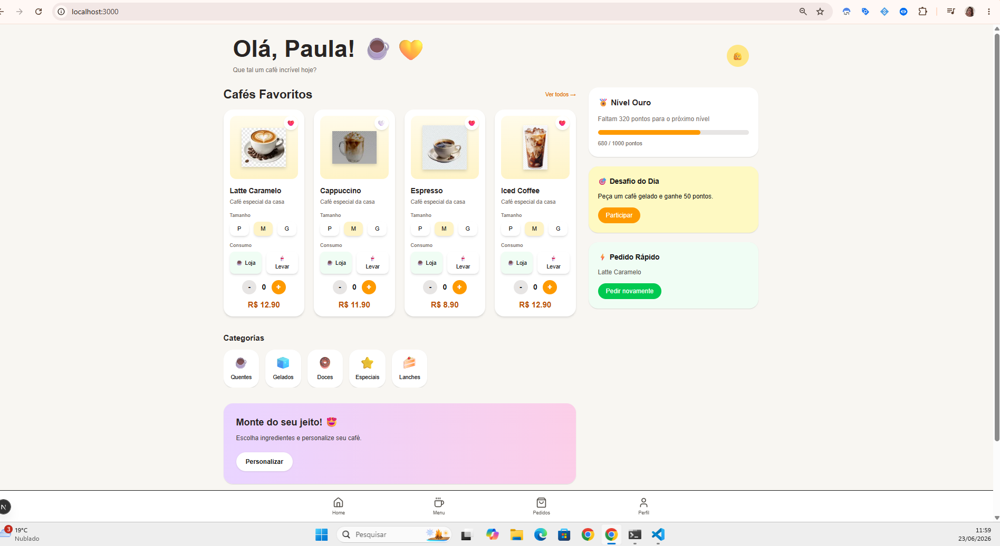
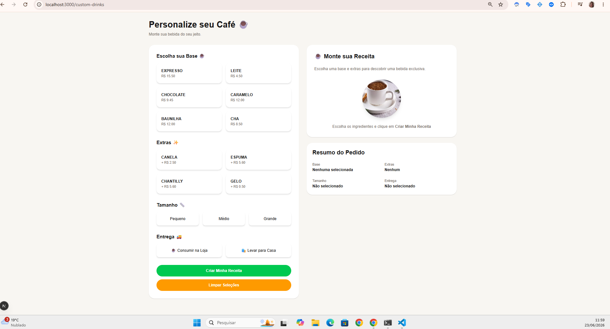
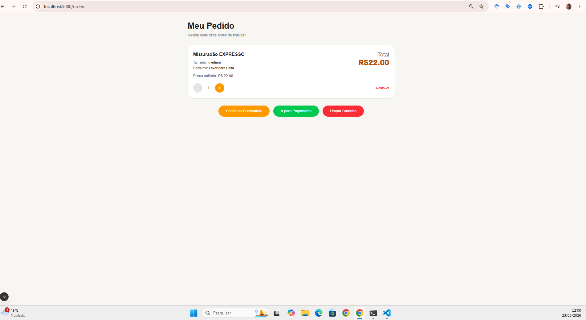
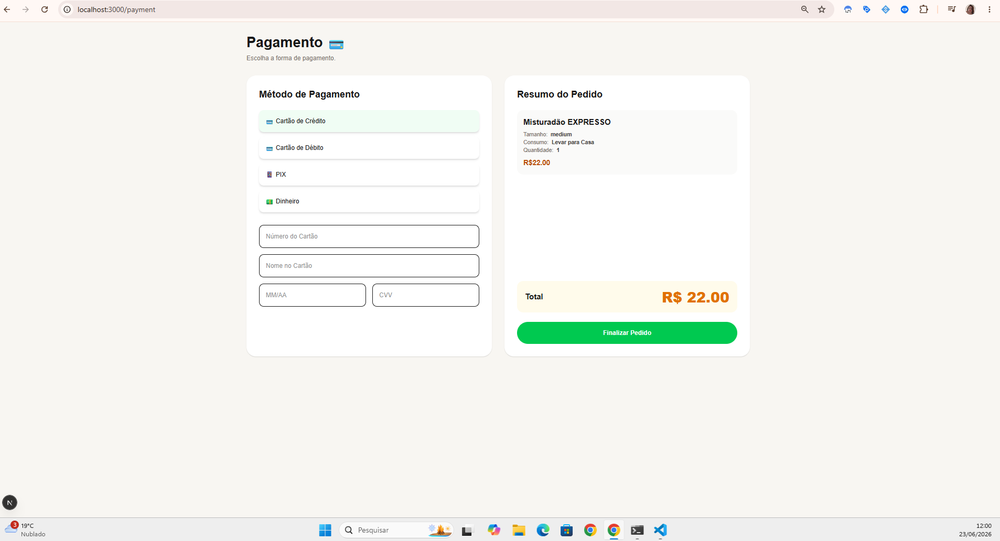
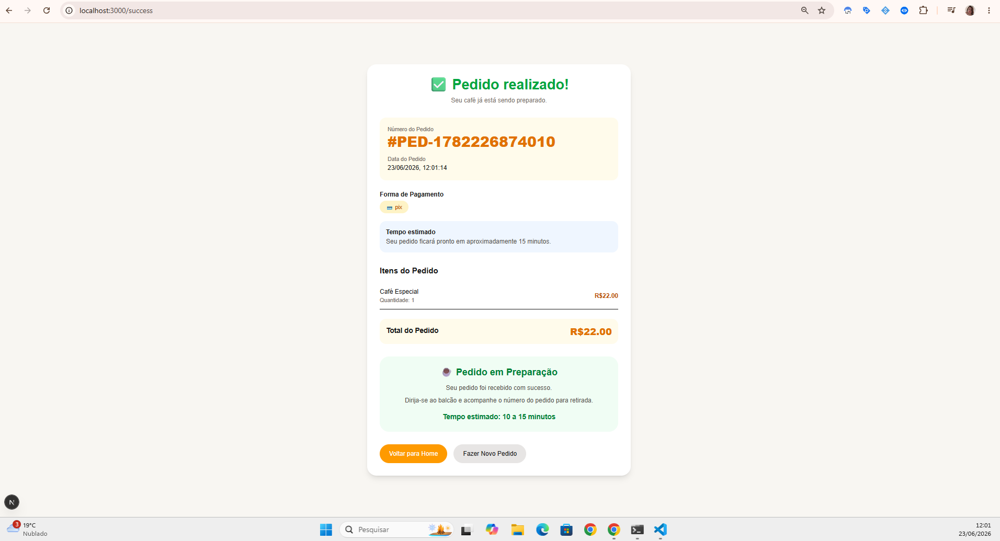

# ☕ Cafeteria Legal

<div align="center">

Sistema Full Stack desenvolvido para simular um ambiente real de uma cafeteria, permitindo pedidos, bebidas personalizadas e fluxo completo de compra.


</div>

---

# 📖 Sobre o Projeto

O **Cafeteria Legal** foi criado para reproduzir um cenário próximo ao dia a dia de desenvolvimento e QA, contendo:

* Frontend em Next.js
* Backend em NestJS
* Banco PostgreSQL
* Prisma ORM
* API REST documentada com Swagger
* Fluxo completo de compra
* Geração de bebidas personalizadas
* Persistência dos pedidos

---

# 📸 Telas

## Home



## Bebidas Personalizadas



## Carrinho



## Pagamento



## Pedido Realizado



---

# 🛠 Tecnologias

## Frontend

* Next.js
* React
* TypeScript
* TailwindCSS

## Backend

* NestJS
* Prisma ORM
* PostgreSQL
* Swagger

## Ferramentas

* Git
* GitHub
* npm
* Concurrently

---

# 📂 Estrutura do Projeto

```bash
cafeteria-legal
│
├── frontend
│
├── backend
│
├── package.json
│
└── README.md
```

---

# 🚀 Instalação

Clone o projeto:

```bash
git clone https://github.com/psmpaulamelo/cafeteria-legal.git
```

Entre na pasta:

```bash
cd cafeteria-legal
```

Instale as dependências do backend:

```bash
cd backend
npm install
```

Instale as dependências do frontend:

```bash
cd ../frontend
npm install
```

Instale as dependências da raiz do projeto:

```bash
cd ..
npm install
```

---

# ▶️ Executando a Aplicação

Com apenas um comando:

```bash
npm run dev
```

Este comando inicia:

### Frontend

```text
http://localhost:3000
```

### Backend

```text
http://localhost:3001
```

### Swagger

```text
http://localhost:3001/api
```

---

# 🔄 Fluxo da Aplicação

```text
Home
 ↓
Catálogo
 ↓
Bebidas Personalizadas
 ↓
Adicionar ao Carrinho
 ↓
Pedidos (/orders)
 ↓
Pagamento (/payment)
 ↓
Pedido Realizado (/success)
```

---

# ☕ Fluxo de Compra

### Escolha da bebida

* Bebidas tradicionais
* Bebidas personalizadas

### Pedido

* Visualização dos itens
* Alteração de quantidade
* Remoção de produtos
* Valor total

### Pagamento

Métodos disponíveis:

* Crédito
* Débito
* PIX

### Finalização

O pedido é enviado para a API e armazenado no banco de dados.

---

# 📚 Documentação da API

Swagger:

```text
http://localhost:3001/api
```

---

# Principais Endpoints

## Drinks

```http
GET /api/drinks
POST /api/drinks
```

## Ingredients

```http
GET /api/ingredients
POST /api/ingredients
```

## Custom Drinks

```http
POST /api/custom-drinks/generate
GET /api/custom-drinks
```

## Orders

```http
POST /api/orders
GET /api/orders
GET /api/orders/:id
PATCH /api/orders/:id/status
DELETE /api/orders/:id
```

---

# 🎯 Objetivo

O projeto foi desenvolvido com foco em reproduzir um ambiente próximo ao encontrado em projetos reais, permitindo:

* Testes Funcionais
* Testes de API
* Testes de Integração
* Testes E2E
* Automação
* Validação de Banco de Dados

---

# 🧪 Quality Assurance

✔ Testes Funcionais

✔ Testes de API

✔ Testes de Integração

✔ Automação Web

✔ Validação de Banco de Dados

✔ Testes End-to-End

---

# 👩‍💻 Desenvolvido por

## Paula Melo

**QA Engineer | Software Quality | Test Automation**

### LinkedIn

https://www.linkedin.com/in/paulasmelo/

### GitHub

https://github.com/psmpaulamelo

---

## 🚀 Próximas Evoluções

* [ ] Implementar testes automatizados
* [ ] Pipeline CI/CD
* [ ] Dockerização da aplicação
* [ ] Testes E2E com Playwright
* [ ] Monitoramento e observabilidade
* [ ] Deploy em nuvem
* [ ] Dashboard administrativo
* [ ] Histórico de pedidos
* [ ] Sistema de autenticação
